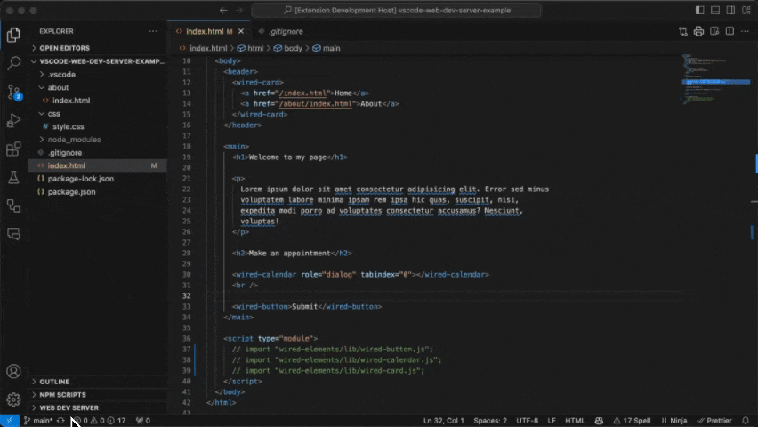
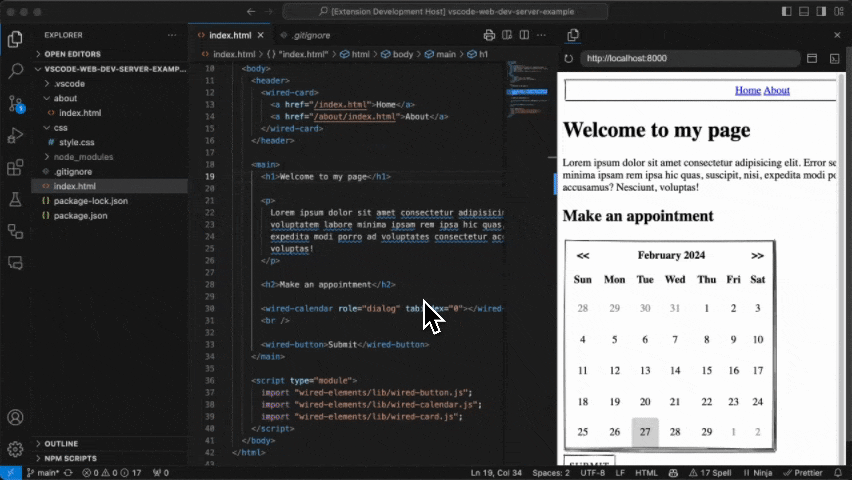
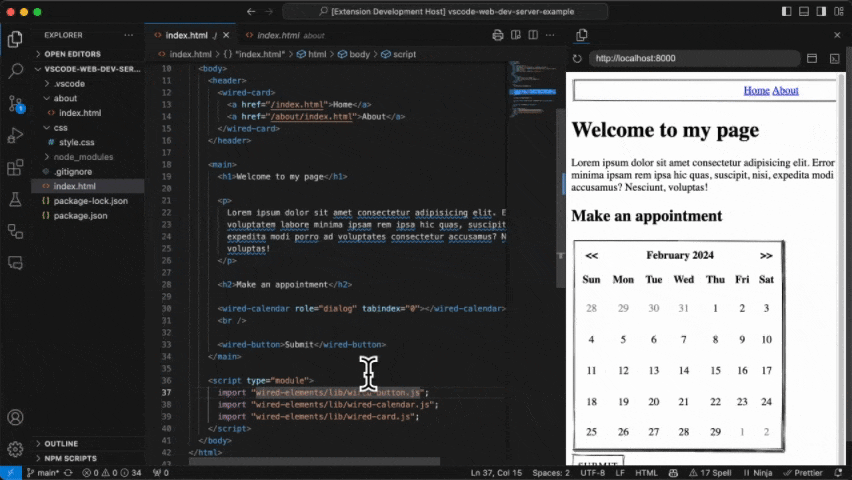
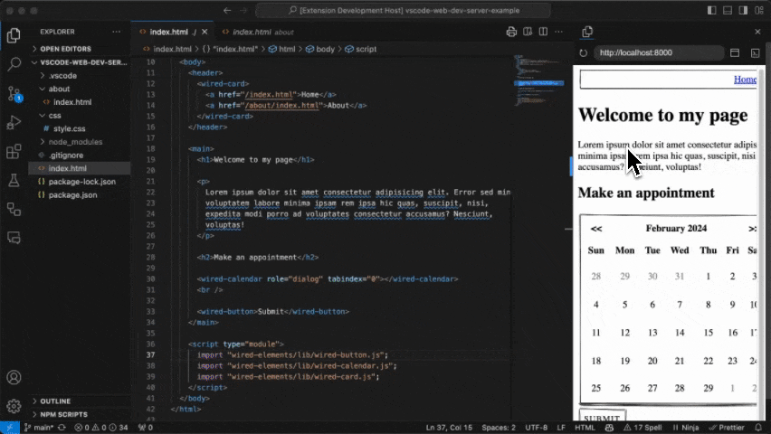

# VsCode Web Dev Server

## Features

1. Runs [@web/dev-server](https://www.npmjs.com/package/@web/dev-server) within a panel in vscode
2. By this it supports node resolution within your html files
   
3. Automatically "follows" opened files (e.g. the url will change as you select files)
   
4. Refresh Button
   
5. Open VsCode DevTools
   
6. Open in external browser

## Known Issues

1. You need to save the file for the preview to update
2. After you fixed a server error you need to manually press the refresh button before the preview updates automatically again

## Contribution

### Get up and running straight away

- Press `F5` to open a new window with your extension loaded.
- Set breakpoints in your code inside `src/extension.ts` to debug your extension.
- Find output from your extension in the debug console.

### Make changes

- You can relaunch the extension from the debug toolbar after changing code in `src/extension.ts`.
- You can also reload (`Ctrl+R` or `Cmd+R` on Mac) the VS Code window with your extension to load your changes.

### ToDo

- Reduce the extension size and improve the startup time by [bundling your extension](https://code.visualstudio.com/api/working-with-extensions/bundling-extension).
- [Publish your extension](https://code.visualstudio.com/api/working-with-extensions/publishing-extension) on the VSCode extension marketplace.
- Automate builds by setting up [Continuous Integration](https://code.visualstudio.com/api/working-with-extensions/continuous-integration).

### Explore the API

* You can open the full set of our API when you open the file `node_modules/@types/vscode/index.d.ts`.

### Run tests

* Open the debug viewlet (`Ctrl+Shift+D` or `Cmd+Shift+D` on Mac) and from the launch configuration dropdown pick `Extension Tests`.
* Press `F5` to run the tests in a new window with your extension loaded.
* See the output of the test result in the debug console.
* Make changes to `src/test/suite/extension.test.ts` or create new test files inside the `test/suite` folder.
  * The provided test runner will only consider files matching the name pattern `**.test.ts`.
  * You can create folders inside the `test` folder to structure your tests any way you want.